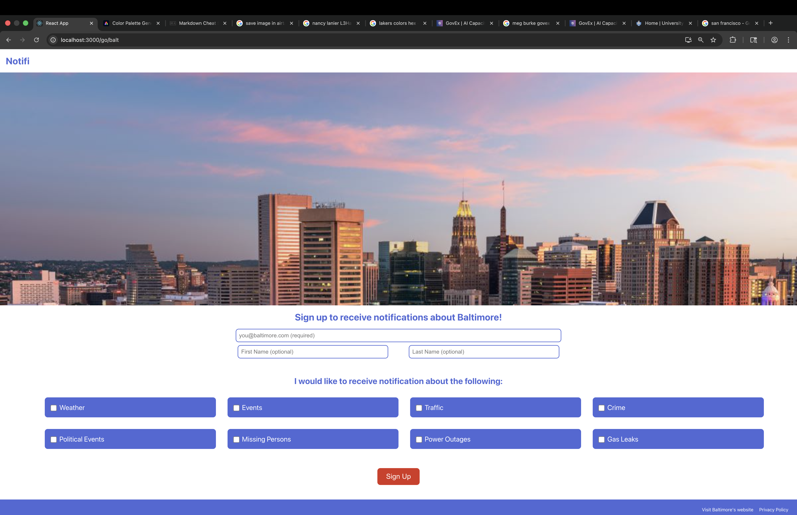
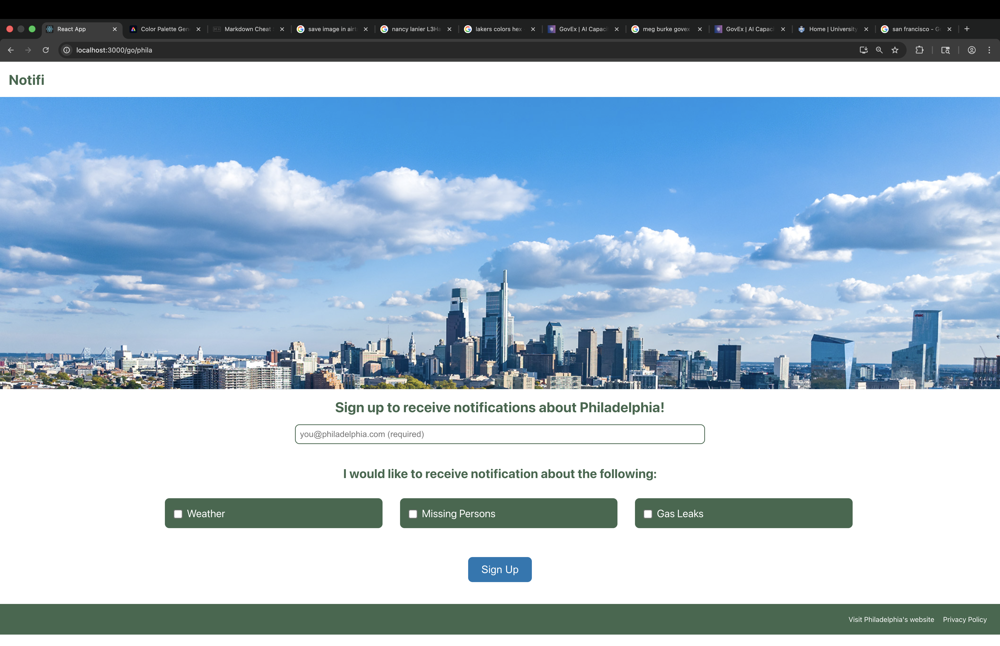
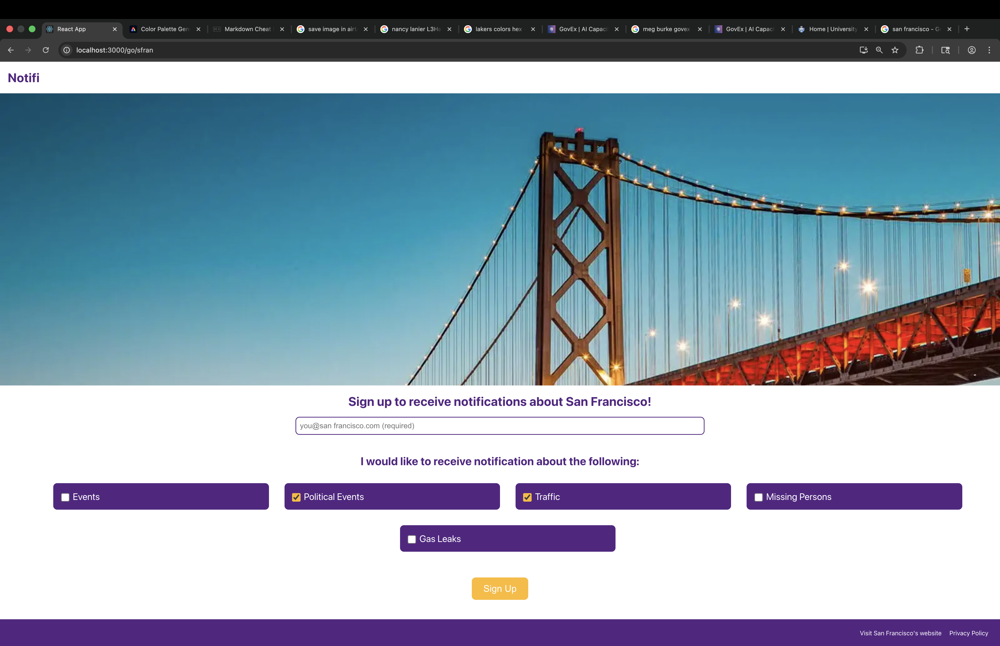
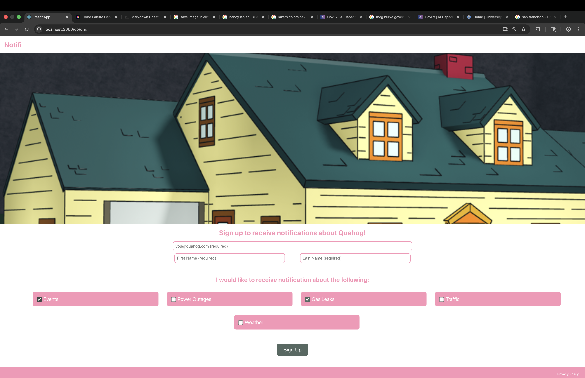
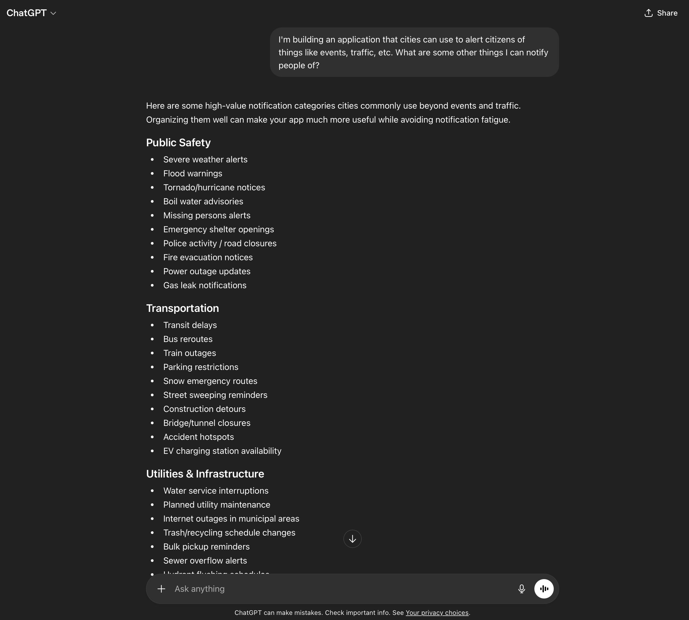
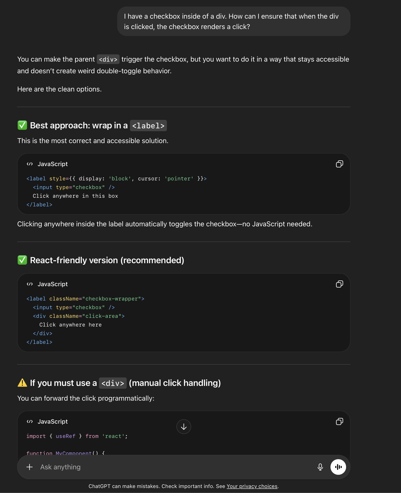
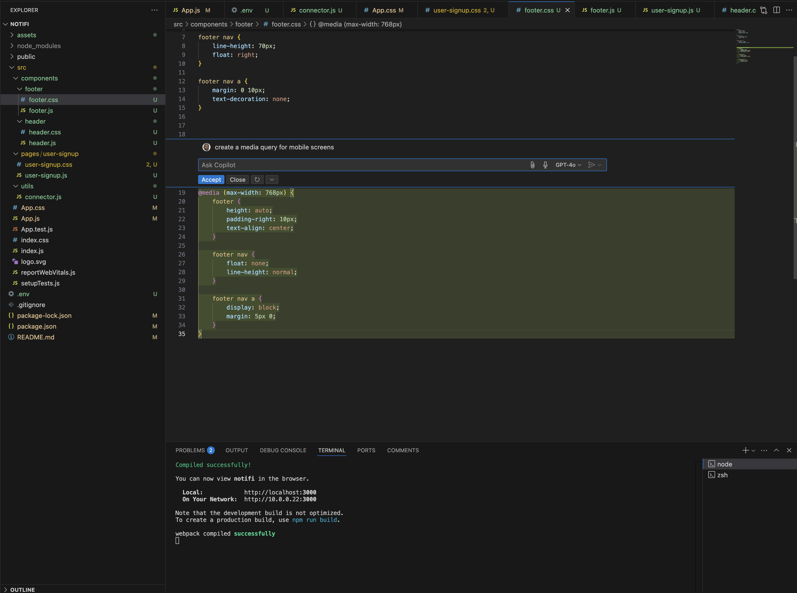

# Notifi
*A notification system designed for use by cities*

### Personalization

 - Cities can add a hero image.
 - Cities can choose primary, secondary and tertiary colors to be applied throughout the application.
 - Cities can choose what types of alerts citizens can subscribe to.
 - Cities can request a first and last name from a subscriber and furthermore can set whether this information is required or optional

 ###### Notice the differences between cities illustrated below:

 
  
   
   

   ### Tech Stack

   * The front-end was built using React that interacts with a a base in Airtable via a node.js server.

   ### AI Usage

   * AI was used conservatively in this project to bounce ideas off of, perform light code reviews and advise when things weren't working as expected. See screenshots below for reference:

   
   
   

   * I gave Copilot a prompt to create a media query for mobile screens and it got me to a really good jumping off point in that regard.